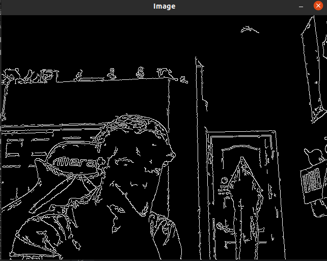

**Colored Edged Camera**

Python version 3.8.2 used in development

Takes the Canny filter from opencv library and changes it from grayscale to
colored, hence the name coloredCanny.py. Uses libraries opencv and numpy.

Dependencies & Installation:

  1. Numpy (version 1.18.4 used in development):
      Go to terminal and type 'pip3 install numpy' in any OS
  2. Opencv (version 4.2.0 used in development):
      Windows: Open terminal and use 'pip install opencv-python'
      Linux: Open terminal and use 'sudo apt install python3-opencv'
  3. Have a webcam and install coloredCanny.py

Development process:
- Started with a simple Canny image filter and decided it would be cool to make
  it show colors as well.

- Started playing with image dimensions and see what would happen if I tweaked
  certain parts of matrices in images.
- Made progress to get very disorganized color, so decided it was best to create
  a class to hold color values and to make functions that is easier to tweak
  rather than hard code it all in a few functions.
- Went over final adjustments of parameters to get ideal rate of change for colors,
  as well as idea amount of edges shown in images by adjusting parameters of cv2.Canny

The following images are snippets of what the output looks like
(insert images of final product here)
